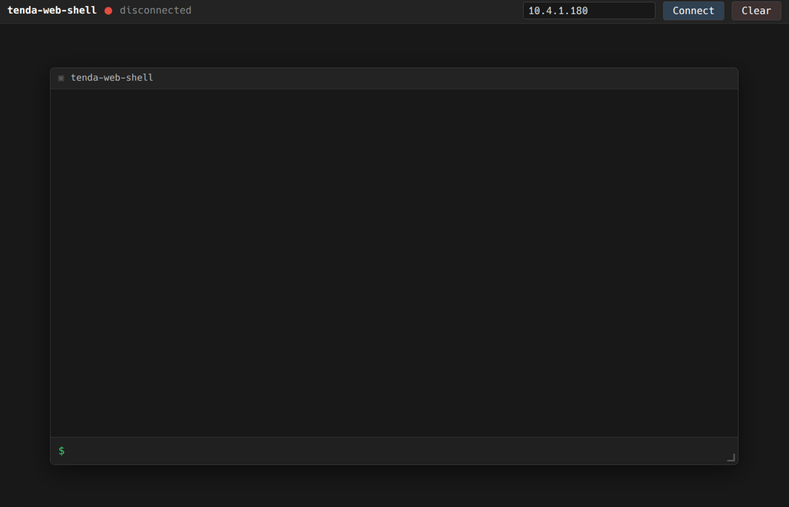
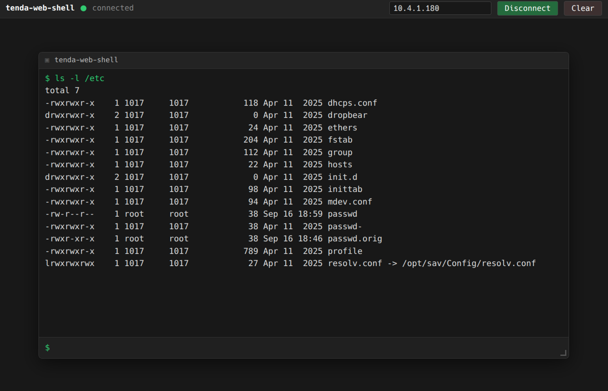

# tenda-web-shell

Web shell with root access for Tenda IP cameras.

Based on the PoC from [Tenda-Smart-Camera-Vulnerability](https://github.com/howitouchyou/Tenda-Smart-Camera-Vulnerability).

Tested on:
- Tenda CH7-WCA V2.0 (firmware V25.4.29.93) — https://www.tendacn.com/in/product/overview/CH7-WCAV2
- Tenda CP7 V2.0 (firmware V21.7.17.28) — https://www.tendacn.com/in/product/overview/CP7V20

## Screenshots

| Disconnected | Connected |
|---|---|
|  |  |

## How it works

The server connects to the camera over UDP in two phases: first a wake packet on port 7320, then a command channel on port 7329. Each command is injected via the `PTEfuseSet` method so the camera executes it as root and POSTs the output back to the server with `wget`.

## Run

    go build -o tendashell .
    ./tendashell

Open http://localhost:7777/, enter the camera IP, click Connect.

## Flags

- `-listen` — HTTP listen address (default `:7777`). The port is also used as the callback port for command output.
- `-advertise` — `host:port` that the camera can reach to POST command output back via `wget`. Auto-detected when omitted: first non-loopback IPv4 of this host + the `-listen` port (e.g. `10.4.1.10:7777`).
